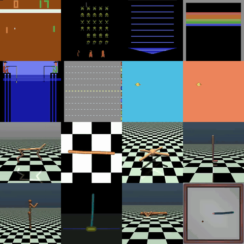

<div align="center">

# Code to Control

**Synthesizing Parameterized Reactive Controllers**

[**Project page**](https://zerghamahmed.github.io/code-to-control) | **Paper** (arXiv link to follow)



</div>

Code to Control learns executable controllers directly from interaction. A language model
writes each controller's structure as a Python program. Derivative-free search fits its
numerical parameters from environment feedback when useful, especially in continuous control.
The program then acts directly as the policy. Choosing an action takes one function call,
with no language-model call and no planning.

## Installation

Use Python 3.10, the version the paper's runs used. The pinned numpy 1.26.4 has no builds for
Python 3.13.

```bash
git clone https://github.com/ZerghamAhmed/code-to-control && cd code-to-control
python3.10 -m venv .venv && source .venv/bin/activate
pip install -r requirements.txt
```

The install is about 600 MB, almost all of it OCAtari's own dependencies.

## Learn a controller

This calls the language model and needs an Anthropic API key. The model writes a controller,
plays an episode with it, reads the trajectory, and revises the program, for 20 episodes.

```bash
export ANTHROPIC_API_KEY=...
python scripts/run_controller_flappy.py --game pong --mode llm \
    --query-mode anthropic --model claude-haiku-4-5-20251001 \
    --max-episodes 20 --max-llm-calls 30 --max-ticks 50000 --stall-ticks 3000 \
    --out runs/pong.json
```

The paper's settings for each game:

| game | `--game` | extra flags |
|---|---|---|
| Pong | `pong` | `--max-ticks 50000 --stall-ticks 3000` |
| Space Invaders | `spaceinvaders` | `--max-ticks 6000` |
| Asterix | `asterix` | `--max-ticks 6000` |
| Breakout | `breakoutoc` | `--max-ticks 6000` |
| Fishing Derby | `fishingderby` | `--max-ticks 6000` |
| Freeway | `freeway` | `--max-ticks 3000` |
| Flappy Bird | `flappy` | `--max-ticks 20000 --target-score 1000000` |

A new run samples the language model afresh, so its score will vary. The paper reports the
median over three runs.

For MuJoCo:

```bash
python scripts/synthesize_mujoco.py halfcheetah
```

This plays 240 steps of random actions, shows 40 of those transitions to the model, and asks
for six feature maps of 14 terms each, using `claude-opus-4-8` as the paper did. It fits every
map with random search, refits the best one three times, and reports the median. `--dry-run`
writes the prompt without calling the model. `scripts/fit_mujoco.py` fits a feature map on its
own.

## Read a controller

Each file in `champions/` is a complete controller. The Pong one is about 35 lines:

```python
lead_ticks = 5  # Predict 5 ticks ahead
predicted_ball_y = ball.y + ball.dy * lead_ticks
```

The episode before it steered toward `ball.y` and scored −8. The model saw that trajectory,
added this prediction, and the next episode scored +18.

The paper reports the median of three runs per game. `champions/pong_best.py` is the best of
the three Pong runs, a 33-line controller that wins 21–0.

A MuJoCo controller has two parts. `champions/mujoco/halfcheetah.py` is the feature map the
model wrote. `champions/mujoco/halfcheetah.json` holds the fitted matrix, the observation
names and the feature normaliser.

## Reproduce the paper's numbers

Every champion controller reported in the paper is included in `champions/`. This plays each
one unchanged and compares its score with the paper. It makes no language-model calls and
needs no API key.

```bash
./reproduce.sh
```

```
game             reported   replayed  result
pong                 18.0       18.0  match
pong_best            21.0       21.0  match
spaceinvaders       490.0      490.0  match
asterix            3100.0     3100.0  match
breakout             19.0       19.0  match
fishingderby         31.0       31.0  match
freeway              22.0       22.0  match
flappy              311.0      311.0  match

task                           paper    replayed  displacement   steps  result
ant                          1003.93     1003.93       10.47 m    1000  match
halfcheetah                  3958.95     3958.95      212.55 m    1000  match
...
```

This was checked in a fresh Python 3.10 environment containing only `requirements.txt`, on
macOS with Apple silicon.

The Atari and Flappy Bird replays use the runner that produced the paper's results, with one
command-line option edited. The MuJoCo replay, `scripts/replay_mujoco.py`, is a standalone copy of the original
evaluator. It plays the paper's ten test episodes per task and reproduces the recorded returns
and displacements exactly. MuJoCo is not guaranteed to be bit-identical across CPU
architectures, so on other machines the MuJoCo numbers may differ in the last digits.

`./reproduce.sh --all` also reruns the fitting behind the paper, about 30 minutes in all:

- `python scripts/flappy_transfer.py` plays the three Flappy Bird champions under eight
  physics changes. Where one dies early, it refits that program's numeric constants with the
  program held fixed and no language-model calls. It checks every cell of Figure 3B, and runs
  in about 4 minutes, or under a minute with `--zero-shot`. With
  `--save champions/flappy_transfer/refits.json` it also writes what each refit changed.
- `python scripts/fit_mujoco.py <task> --check` refits a released MuJoCo controller from
  scratch with random search and confirms that its weights come out identical.

`python scripts/measure_latency.py` times one call to each Atari controller's `policy`, over
300 states per game. On an Apple M4 Max it prints about 11 µs, the median across games, against
11.4 µs in the paper.

## What's in this repository

- `champions/`: every controller reported in the paper. Each is a `.py` file, with a `.json`
  beside it holding its score and run settings. `champions/mujoco/` holds the MuJoCo feature
  maps and their fitted matrices. `champions/flappy_transfer/` holds the three Flappy Bird
  champions used in Figure 3B, and `refits.json`, the constants each refit moved and the
  program it produced.
- `reproduce.sh`: replays every champion and checks its score.
- `scripts/run_controller_flappy.py`: the runner behind the Atari and Flappy Bird results.
  It synthesizes a controller with the language model, or replays a saved one.
- `scripts/flappy_transfer.py`: Flappy Bird under changed physics, zero-shot and refit.
- `scripts/synthesize_mujoco.py`, `scripts/fit_mujoco.py`, `scripts/replay_mujoco.py`: the
  MuJoCo pipeline, from feature-map synthesis to fitting to replay. `scripts/mujoco_tasks.json`
  gives each task's observation names.
- `scripts/measure_latency.py`: decision latency of the Atari controllers.
- `abstraction_prompts/general/`: the prompts, verbatim.
- `theorycoder/`: the object API that controllers call, the trajectory formatter, and the
  language-model client.
- `*_env.py`, `game_registry.py` and `record_io.py`: the game environments and the run-record
  reader. They sit at the top level, and the prompts under `abstraction_prompts/`, because the
  runner looks for them there.
- `docs/`: the project page, built by `tools/build_page.py`. To preview it, run
  `python tools/serve.py` and open http://localhost:8000.

See [PROVENANCE.md](PROVENANCE.md) for which code produced each number, and for the ways
this release differs from the original runs.

## Citation

```bibtex
@article{ahmed2026codetocontrol,
  title   = {Code to Control: Synthesizing Parameterized Reactive Controllers},
  author  = {Ahmed, Zergham and Tenenbaum, Joshua B. and Bates, Chris and Gershman, Samuel J.},
  year    = {2026}
}
```

## License

MIT, see [LICENSE](LICENSE). The project page in `docs/` is adapted from Nerfies and is
licensed CC BY-SA 4.0. [THIRD_PARTY_LICENSES.md](THIRD_PARTY_LICENSES.md) lists it and the
other bundled web files.
